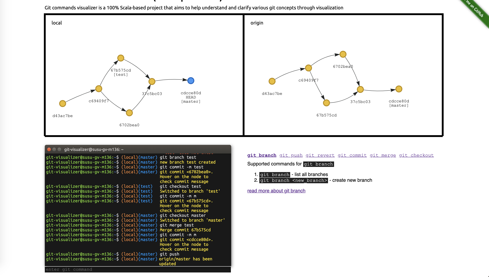

# Git Commands Visualizer (Scala-powered)

## Idea

I felt an urge to do something with Scala. Git concepts are proved to be complicated, and I used to have issues of
comprehending them. Git Commands Visualizer is my humblest effort to help close the gap between complex git concepts
and understanding them through visualization. This project is powered by `scalaJs` and `slinky`for their great integration
with FE ecosystem that allows writing the UI smoothly. The rest and core logics are vanilla Scala that handles parsing
user inputs, manipulating and maintaining various internal tree structures and updating them correspondingly.

## Where can I play with it?

Here! [Try me](https://ssdong.github.io/git-command-visualizer-tool/)

Simply by hitting `git commit -m <message>` and it will create a commit node for you. You don't have to create anything to make
a successful commit .

## Release
* 2021-03-20
  * Supported git commands
    1. `git branch`
       - `git branch`
    2. `git commit`
       - `git commit -m <message>`
    3. `git checkout`
       - `git checkout <branch>`
    4. `git merge`
       - `git merge <branch or hash>`
    5. `git push`
       - `git push`
       - `git push origin <head or HEAD>`
       - `git push origin <branch>` 
    6. `git revert`
       - `git revert <commit>`
    

## Future changes
* Support cherry-pick command
* UI improvements. Terminal automatically scroll down when user type commands
* The bouncing behavior of the nodes may seem a bit annoying. There might be room for improvements with no physics and no overlapping.

## Miscellaneous
* The rendering of the git tree is powered by VisJS with a Scala-wrapper that I had implemented. It comes naturally with
a physics bouncing behaviour. The nodes allow dragging and resizing.

## How to run locally
Simply clone the project and run `sbt dev` in the terminal. It will be ready on `localhost:8080`!

## Credits
The idea of this project is inspired by [explain git with d3](https://onlywei.github.io/explain-git-with-d3/). The author
was once my supervisor, and he is one of the best. :)
